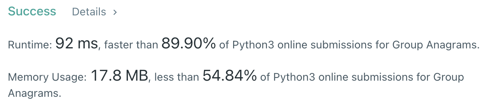

# [문자열 조작] 그룹 애너그램

[문제풀기](https://leetcode.com/problems/group-anagrams/)

## 문제

애너그램 : 문자를 재배열하여 다른 뜻을 가진 단어로 바꾸는 것

### 구해야 하는 것

- 애너그램 관계에 있는 단어들끼리 그룹핑하기

### 주어진 것

1. 단어를 정렬하여 서로 같은 것끼리 모으기 → 정렬한 단어를 키로 하는 딕셔너리에 추가하는 방식, 정렬은 내장함수

## 풀이

```py
import collections
strs = ["eat","tea","tan","ate","nat","bat"]
anagrams = collections.defaultdict(list)
for word in strs:
  anagrams[''.join(sorted(word))].append(word)
print(anagrams.values())
```


