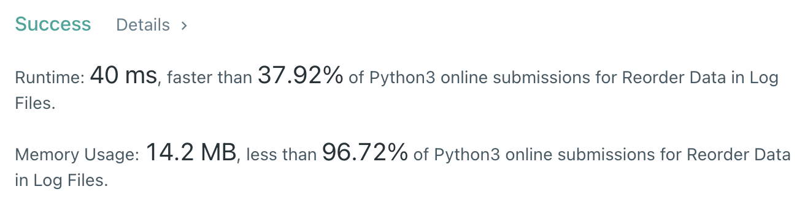

# [문자열 조작] 로그 파일 재정렬

[문제풀기](https://leetcode.com/problems/reorder-data-in-log-files/)

## 문제

### 구해야 하는 것

- 재정렬된 로그

### 주어진 것

1. 로그의 가장 앞 부분은 식별자 + 문자가 숫자보다 앞에 오도록 정렬 → 공백을 기준으로 로그를 쪼개서 식별자를 제외한 위치부터 문자 또는 숫자로 분류
2. 문자가 동일할 경우 식별자순으로 정렬 + 숫자는 입력 순서대로 정렬 → 정렬 기준이 2개(1순위는 문자, 2순위는 식별자), 람다식을 이용

## 풀이

```py
logs = ["dig1 8 1 5 1","let1 art can","dig2 3 6","let2 own kit dig","let3 art zero"]
letters, digits = [], []
for log in logs:
  if log.split()[1].isdigit():
    digits.append(log)
  else:
    letters.append(log)
letters.sort(key=lambda x: (x.split()[1:], x.split()[0]))
print(letters + digits)
```


