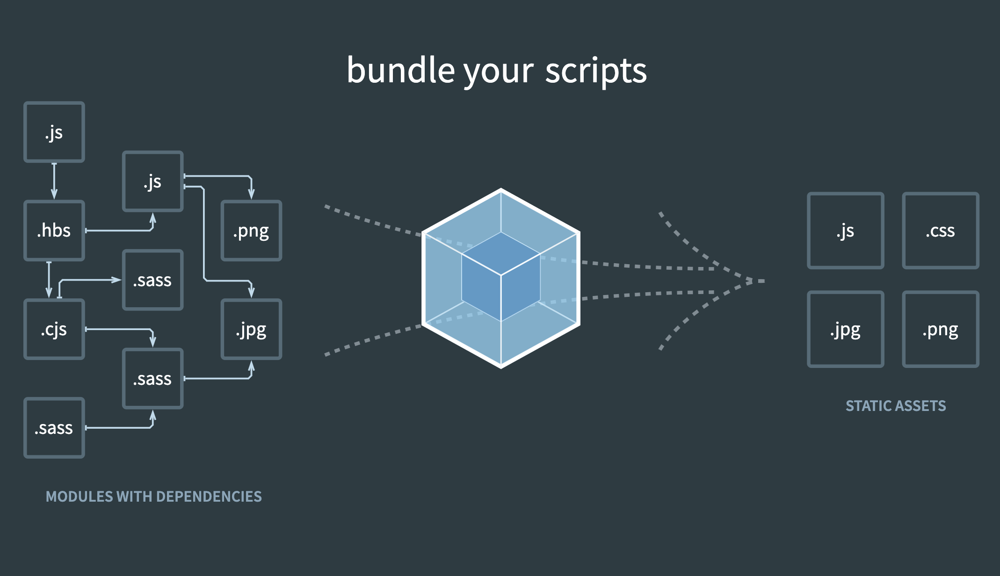

# 프로젝트 설정하기

## 리액트 관련 dependencies 설치하기(+ 타입스크립트)

- react react-dom
- typescript @types/react @types/react-dom

## ESLint와 Prettier 설정하기

### 관련 devDependencies 설치하기(+ 타입스크립트)

- prettier eslint-plugin-prettier eslint-config-prettier
- @typescript-eslint/eslint-plugin@latest @typescript-eslint/parser@latest

### 설정 파일 생성하기

- .eslintrc
- .prettierrc

### VSCode 설정하기

1. ESLint와 Prettier 익스텐션을 설치한다.
2. Settings에서 'Format On Save'를 검색한 뒤 체크한다.
3. settings.json 파일에 다음 코드를 추가한다.
   ```js
   ...
   "editor.codeActionsOnSave": {
    "source.fixAll": true
   },
   ...
   ```
4. Settings에서 Default Formatter를 검색하여 Prettier로 설정한다.

## 타입스크립트 설정하기

- tsconfig.json

**타입스크립트 라이브러리로 TS를 JS로 변환하고, Babel을 이용하여 CSS, 이미지 등의 나머지 리소스까지 모두 변환한 뒤 Webpack으로 번들링 하는 과정을 거친다.**

## 바벨과 웹팩 설정하기

- ES6는 IE를 제외하고는 거의 대부분 지원한다. → [ES6 Compatability table](https://kangax.github.io/compat-table/es6/)
- 하지만 ES6+와 제안 단계에 있는 ES.NEXT는 브라우저에 따라 지원율이 제각각이다.
- 우리는 그냥 최신 문법으로 개발하고, 바벨을 이용하여 브라우저 환경에 맞게 트랜스컴파일하자.
- ESM(ES6 모듈)을 대부분의 모던 브라우저에서 사용 가능하나, 아직까지는 별도의 모듈 로더를 사용하는 것이 일반적이다.

### 웹팩

설치하기 : `yarn add -D webpack webpack-cli @types/webpack @types/node`

모듈 번들러

- 쪼개진 자바스크립트 파일(모듈)을 HTML이 실행할 수 있는 하나의 자바스크립트 파일로 합쳐준다.
- 자바스크립트 뿐만 아니라 CSS, 이미지 등의 리소스도 번들링해준다.



**👨🏻‍💻 Webpack이 자바스크립트 파일을 번들링하기 전에 Babel을 로드하여 ES6+/ES.NEXT 사양의 소스코드를 ES5 사양의 소스코드로 트랜스파일링하는 작업을 먼저 실행한다.**
→ `yarn add -D babel-loader`

### 바벨

설치하기 : `yarn add -D @babel/core @babel/cli`

트랜스파일러  
최신 문법, 실험적인 문법을 지원한다.

ES6+/ES.NEXT 사양의 소스코드를 ES5 사양의 소스코드로 트랜스파일링해도 ES5 사양으로 대체할 수 없는 기능은 트랜스파일링이 되지 않고 남아있다.  
이때 IE 같은 구형 브라우저에서도 최신 메서드나 최신 객체를 사용하기 위해서는 @babel/polyfill을 설치해야 한다.  
→ `yarn add @babel/polyfill` : @babel/polyfill은 개발 환경에서만 사용하는 것이 아니라 실제 운영 환경에서도 사용해야 한다.  
→ webpack.config.js 파일의 entry 배열에 폴리필을 추가한다.

### webpack.config.ts

Webpack이 실행될 때 참조하는 설정 파일

- entry에서 파일을 선택하면 module에 정해진 rules대로 js로 변환하여 하나의 파일로 합쳐준다(output). plugins는 합치는 중에 부가적인 효과를 준다.
- ts는 babel-loader로, css는 style-loader와 css-loader를 통해 js로 변환된다. → `yarn add -D css-loader style-loader`
- publicPath가 /dist/고 [name].js에서 [name]이 entry에 적힌대로 app으로 바뀌어 /dist/app.js가 결과물이 된다.

#### tsconfig-for-webpack-config.json

- webpack할 때 webpack.config.ts를 인식 못하는 문제로 인해 추가
- `cross-env` 설치 후 package.json의 scripts의 build를 `cross-env TS_NODE_PROJECT=\"tsconfig-for-webpack-config.json\" webpack`로 수정한다.

#### Babel 프리셋 설치하기

[참고] plugin들의 모음이 preset이다.

- @babel/preset-env : 필요한 플러그인들을 프로젝트 지원 환경에 맞춰 동적으로 결정해준다. → [browserslist 형식](https://github.com/browserslist/browserslist#full-list)
- @babel/preset-react
- @babel/preset-typescript

- 프리셋을 설치했으면 webpack.config.ts(또는 babel.config.ts, 웹팩을 사용하지 않는 경우)에도 추가해주어 해당 프리셋을 사용하겠다고 알린다.(웹팩을 사용하는 경우 babel-loader options에 추가)
- 그 외 필요한 플러그인들은 그때마다 설치하면 되고, [Babel 홈페이지](https://babeljs.io/) 검색 창에 제안 사양의 이름을 입력하여 해당 플러그인을 검색할 수 있다.
- 웹팩을 사용하지 않고 바벨만 사용하여 빌드한 경우 바벨은 기본적으로 노드가 지원하는 CommonJS 방식의 모듈 로딩 시스템을 따르기 때문에 브라우저에서 실행하면 오류가 난다.
- 그렇다고 브라우저의 ESM(ES6 모듈)을 사용하도록 Babel 설정을 할 수도 있지만 아직까지는 ESM 사용은 시기상조. → 그냥 Webpack을 쓰자.

## 웹팩 데브 서버와 핫 리로딩 설정하기

브라우저 새로고침 시에는 데이터가 모두 날라가지만 핫리로딩은 데이터가 유지되면서 화면을 변경시켜준다.

### 웹팩 데브 서버 설치하기

설치하기 : `yarn add -D webpack-dev-server ts-node @types/webpack-dev-server`

⚠️ webpack-cli 4버전에서 변경점 발생!

- package.json의 scripts의 dev를 `cross-env TS_NODE_PROJECT=\"tsconfig-for-webpack-config.json\" webpack serve --env development`로 변경
- 윈도우에서도 명령어가 실행되게 하려면 cross-env 설치

- webpack.config.ts에 개발용 서버인 'devServer' 옵션을 추가한다.(port는 3090, publicPath는 /dist/)
- webpack serve할 때 webpack.config.ts를 인식 못하는 문제 해결

### 핫 리로딩 설정하기

설치하기 : `yarn add -D @pmmmwh/react-refresh-webpack-plugin react-refresh`  
webpack.config.ts → babel-loader options에 env 및 plugins로 추가

## 폴더 설정하기

### 폴더 구조 잡기

- layouts
- pages
- components
- hooks
- utils : 기타 함수

각 컴포넌트는 컴포넌트 폴더 아래에 index.tsx와 styles.tsx를 생성한다.

### 경로 편하게 설정하기

상대 경로를 절대 경로처럼 편하게 접근할 수 있게 하는 설정

설치하기 : `yarn add -D tsconfig-paths`

- tsconfig.json에서 'baseUrl'와 'paths'를 설정한다.
- webpack.config.ts에서 'resolve' 안에 'alias'를 설정한다.

## 이모션 라이브러리 설정하기

설치하기 : `yarn add @emotion/react @emotion/styled`, `yarn add -D @emotion/babel-plugin`  
→ webpack.config.ts의 babel-loader options에 env 및 plugins로 추가

## 라우터

- `yarn add react-router react-router-dom`
- `yarn add -D @types/react-router @types/react-router-dom`
- @layouts/App 작성한 뒤 client.tsx에서 App을 BrowserRouter로 감싸준다.
- @layouts/App에 Switch, Route, Redirect를 넣는다.

## 코드 스플리팅

설치하기 : `yarn add @loadable/component @types/loadable\_\_component`

- 필요 없는 컴포넌트는 처음에 불러오지 않고, 필요한 컴포넌트는 그때그때 불러오도록 한다.
- 3초 안에 화면이 나타나지 않으면 사용자 이탈률이 높아지기 때문에 라우터를 코드 스플리팅해준다.

### 어떤 컴포넌트를 코드 스플리팅 할 것인가?

- 일단 페이지 단위 : 해당 페이지에서 굳이 다른 페이지를 가져올 필요 없다.
- 서버 사이드 렌더링 안 될 아이들?
