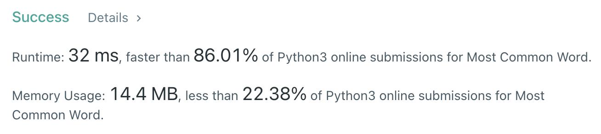

# [문자열 조작] 가장 흔한 단어

[문제풀기](https://leetcode.com/problems/most-common-word/)

## 문제

### 구해야 하는 것

- 금지된 단어를 제외하고 가장 흔하게 등장하는 단어

### 주어진 것

1. 대소문자 구분 안함 → 소문자로 통일
2. 구두점(마침표, 쉼표 등) 무시 → 정규식으로 구두점 제거
3. 금지된 단어 제거 → if문을 포함한 리스트 컴프리헨션
4. 빈도 수가 가장 높은 단어 구하기 → 데이터 개수를 셀 때 유용한 collections 모듈의 Counter 클래스

## 풀이

```py
from collections import Counter
import re
paragraph = "Bob hit a ball, the hit BALL flew far after it was hit."
banned = ["hit"]
words = [word for word in re.sub(r'[^\w]', ' ', paragraph).lower().split() if word not in banned]
counts = Counter(words)
print(counts.most_common(1)[0][0])
```


