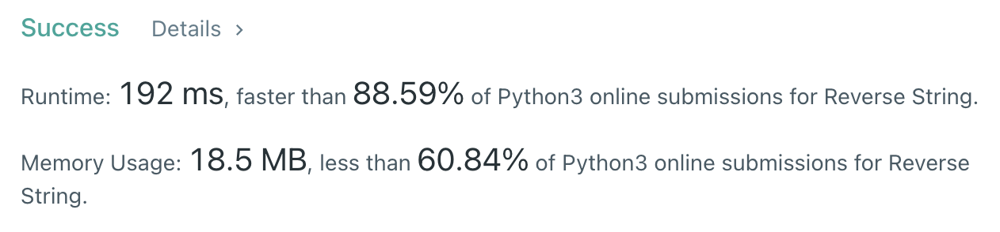

# [문자열 조작] 문자열 뒤집기

[문제풀기](https://leetcode.com/problems/reverse-string/)

## 문제

### 구해야 하는 것

- 뒤집힌 문자 리스트

### 주어진 것

1. 문자 리스트 뒤집기 → 내장 함수 또는 슬라이싱 또는 투 포인터 방식

## 풀이

- 내장 함수 : `print(s.reverse())`
- 슬라이싱 : `print(s[::-1])`

내장 함수와 슬라이싱은 너무 간단하므로 투 포인터를 이용해 스왑하는 방식을 사용하였다.

```py
s = ['h', 'e', 'l', 'l', 'o']
# s = ['h', 'a', 'l', 'o']
left, right = 0, len(s)-1
while left < right:
  s[left], s[right] = s[right], s[left]
  left += 1
  right -= 1
  print(s)
```


